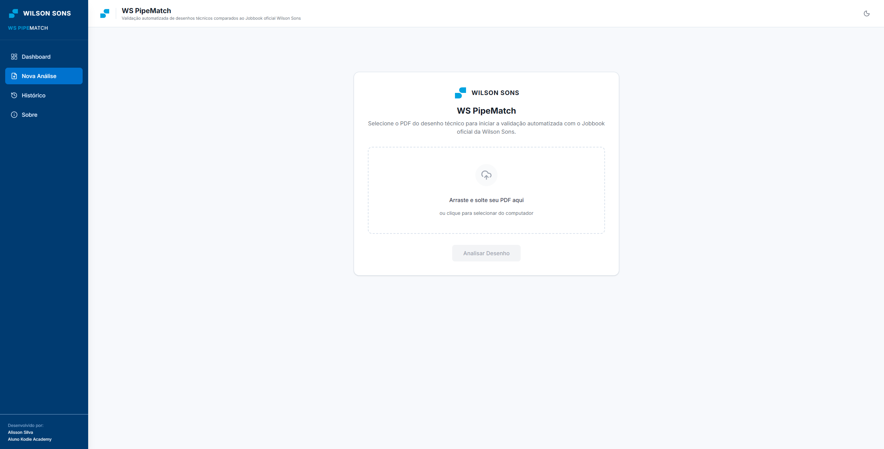
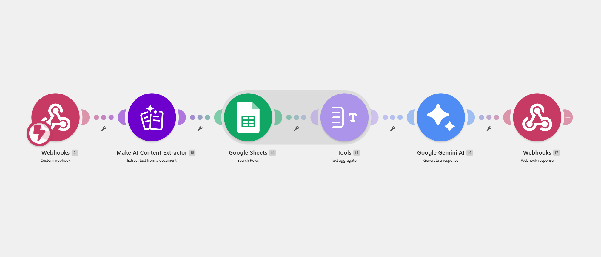
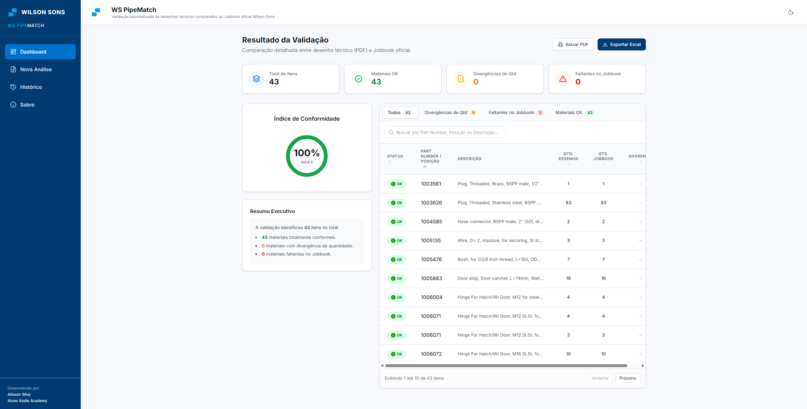

# 🚢 AI-Powered BOM Reconciliation
## Desafio Final 1 — Power Developers | Kodie Academy

---

## 📌 Sobre o Projeto

Este projeto foi desenvolvido como solução para o **Desafio Final 1 da Kodie Academy**, com o objetivo de automatizar um dos maiores gargalos da engenharia naval e industrial: a **conciliação manual de Listas de Materiais (BOM - Bill of Materials)** de desenhos técnicos com os dados de controle logístico (*Jobbook*).

A aplicação utiliza Inteligência Artificial generativa de contexto longo para ler desenhos técnicos complexos em PDF, cruzar com dados estruturados de planilhas e gerar relatórios de conformidade e divergências instantaneamente.

---

## 🏗️ Arquitetura da Solução (Fluxo Make)

O fluxo de automação foi estruturado utilizando exatamente **6 módulos no Make**, garantindo uma pipeline síncrona e eficiente entre a interface web e o modelo de linguagem:

1. **Webhooks (Custom webhook):** Recebe o arquivo PDF enviado pela interface web.
2. **Make AI Content Extractor (Extract text from a document):** Faz a leitura técnica e extrai o texto/tabela do PDF.
3. **Google Sheets (Get Range Values):** Puxa os dados atualizados do Jobbook (ex: *WS 176*).
4. **Tools (Text aggregator):** Agrupa as linhas da planilha em um bloco de texto unificado.
5. **Google Gemini AI (Generate a response):** Processa o prompt técnico cruzando o desenho com o Jobbook utilizando o modelo `gemini-1.5-pro`, retornando um JSON estruturado.
6. **Webhooks (Webhook response):** Devolve a resposta estruturada diretamente para o front-end.

---

## 📸 Demonstração da Interface e Fluxo

*(Dica: Substitua as imagens abaixo pelos prints reais do seu projeto)*

### 1. Interface Web Front-End
> Aqui o usuário faz o upload do desenho técnico em PDF.
> 

---

### 2. Fluxo Automatizado no Make (Os 6 Módulos)
> Visão geral do cenário configurado no Make.
> 
> 

---

### 3. Resultado da Conciliação (JSON / Dashboard)
> Exemplo do relatório estruturado gerado pela IA e exibido na tela.
> 

---

## ⚙️ Stack Tecnológica

| Camada | Tecnologia | Propósito |
| :--- | :--- | :--- |
| **Front-End** | HTML / Web App / Streamlit | Interface de usuário para envio do arquivo e exibição de resultados. |
| **Orquestração** | **Make (Integromat)** | Orquestração do pipeline de dados, webhooks e tratamento de arrays. |
| **Base de Dados** | **Google Sheets** | Armazenamento e atualização dinâmica do Jobbook (*WS 176*). |
| **Inteligência Artificial** | **Google AI Studio (Gemini 1.5 Pro)** | Leitura ótica/contextual de documentos e cruzamento lógico de engenharia. |

---

## 🚀 Como Executar / Testar

1. **Front-end:** Acesse o link da aplicação hospedada.
2. **Upload:** Selecione um desenho técnico em PDF válido da disciplina de tubulação (ex: amostra do sistema CAT3512).
3. **Processamento:** O Make acionará a pipeline, buscará o Jobbook na nuvem e enviará para a API do Gemini.
4. **Saída:** O sistema retornará um relatório detalhado separando:
   - Materiais com status `OK` (presentes no desenho e no Jobbook).
   - Materiais faltantes no Jobbook.
   - Divergências de quantidade.

---

## 👤 Autor

* **Professor Leonardo** * *Kodie Academy — Power Developers*
